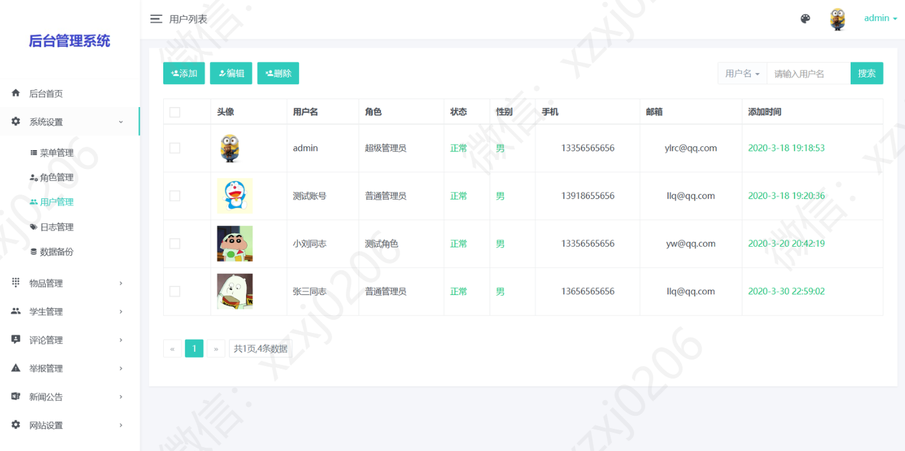
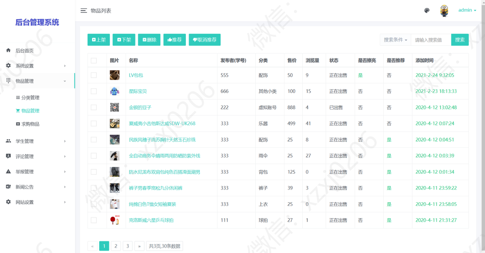
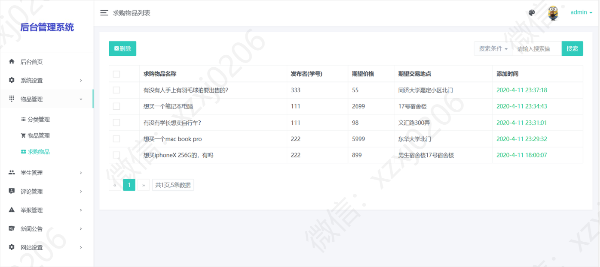
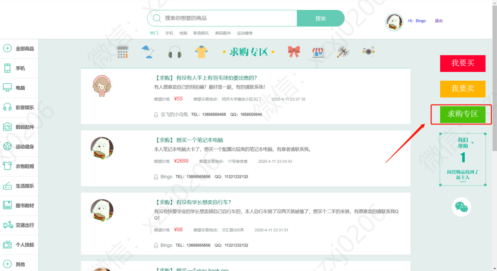

###  给个Star星吧！以此鼓励、谢谢支持呀！！

# 校园二手市场

###项目运行环境
1、jdk版本：1.8
3、mysql数据库版本：8.0
4、编译工具：IntelliJ IDEA 2020.1.1
5、数据库可视化工具：Navicat Premium 15
6、maven版本：maven3.6.3

###运行步骤
1、安装jdk1.8,配置环境变量

2、安装mysql8.0,配置环境变量

3、安装Navicat

4、导入ershou.sql数据库文件

5、安装IDEA

6、导入项目concert

7、运行项目

访问url

后台：8080  初始 可用账号 admin  123456

前台：/home/index/index  

初始可用账号：张三 10000/123456   李四：10001/123456

## 一、介绍

基于springboot的校园二手交易平台

## 二、项目功能介绍

### 1、后台功能介绍

1、菜单管理  2、角色管理
3、用户管理 4、日志管理
5、数据备份 6、分类管理
7、物品管理 8、求购物品
9、用户管理 10、评论管理
11、举报管理 12、公告管理
13、网站设置 14、搜索功能

### 2、前台功能介绍

1、用户注册 2、用户注册 3、个人资料编辑 4、发布商品（卖）
 5、购买商品（买） 6、求购专区 7、发表评论 8、搜索商品

## 组织架构图

## E-R图

## 三、后台部分页面展示

## 四、前台部分页面展示

